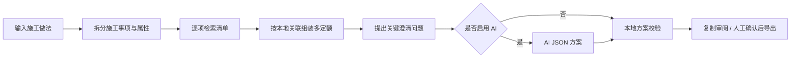

<div align="center">
  
  <h1>山东定额助手</h1>
  <p>把自然语言施工描述转成可核验“清单 + 多定额组合”的 Windows AI 辅助套价工具</p>

  [](https://www.python.org/)
  [](#运行要求)
  [](https://github.com/loveramarois-byte/shandong-quota-assistant/actions/workflows/tests.yml)
  [](LICENSE)
</div>

> [!IMPORTANT]
> Git 源码历史不直接存放数 GB 的数据库和 PDF。项目的 **完整版 Release** 单独提供授权结构化资料库；普通套项不要求另装 PDF，已登记原书页仅作为换算、系数和争议项的辅助复核入口。API Key 和任何第三方计价软件文件始终不会随软件提供。

## 普通用户直接安装

不需要安装 Python，也不需要自己准备数据库：

1. 打开 [GitHub Releases](https://github.com/loveramarois-byte/shandong-quota-assistant/releases/latest) 或 [Gitee 发行版](https://gitee.com/bbbbo-liu/shandong-quota-assistant/releases)。
2. 只下载 `ShandongQuotaAssistant-Setup-0.8.9.exe`。
3. 双击后只需点一次“一键安装”。软件默认安装到当前用户目录，不要求管理员权限，不再询问安装位置；进度完成后会自动创建桌面和开始菜单入口并启动。
4. 安装完成即可使用本地检索；需要 AI 时，再在设置中填写自己的 DeepSeek、智谱或兼容接口。未签名版本可能显示 Windows“未知发布者”提示，请先核对 Release 中的 SHA-256。

需要批量部署时，可使用静默参数：`ShandongQuotaAssistant-Setup-0.8.9.exe /VERYSILENT /SUPPRESSMSGBOXES /NORESTART`。

完整版包含山东 2016/2025 定额、2013/2024 清单、清单定额关联和人材机消耗。结构化资料是普通套项的主要依据；紧凑安装包不携带 PDF 原书，PDF 页不是确认和导出的强制门禁。资料权利说明与适用边界见 [DATA_NOTICE.md](legal/DATA_NOTICE.md)。

## 为什么做这个项目

工程造价人员经常需要把一段施工做法拆成多个事项，再逐项核对清单、主定额、调整项和运输项。本项目先用可追溯的本地资料形成结构化草案，再让 AI 只在本轮候选白名单中补充判断，最终由本地校验器和人工确认把关。

## 核心能力

- **专业隔离**：建筑、安装、市政、园林始终单专业检索；所选专业完全无结果且描述指向明确时，只自动切换到一个高置信度专业。
- **施工事项拆分**：把一段复合描述拆成独立事项，保留每项原文片段、数值属性和否定条件。
- **多定额方案**：一条清单可组合主项、增补、调整、运输、换算和备选定额，不再只展示四组候选。
- **关键条件澄清**：只追问会改变方案的条件；用户的短回答会合并回原事项并局部重算语义上下文。
- **稳定决策边界**：专业规则先确定必问条件，AI 不能随机新增、删除澄清项或降级本地可确认方案。
- **确定性校验**：AI 只能返回 JSON 和本轮 record ID；专业、版本、白名单及清单定额关联不通过时不会进入可确认方案。
- **错误套项熔断**：对象、动作、材料、介质用途或施工部位出现硬冲突时，统一禁止确认、复制和导出。
- **整单最差状态**：复合描述显示“可确认事项 / 全部事项”，任何未解决事项都会阻止整单被误标为完成。
- **真实澄清选项**：材料、管径、土球/胸径等选项来自本轮候选分面，不再显示空泛的占位选择。
- **本地优先**：SQLite FTS5 全文检索，本地候选不依赖网络或 AI。
- **条件排序**：根据施工方式、土类、深度、材料和部位等条件调整候选顺序。
- **结构化资料为主**：清单、定额、关联和人材机数据直接参与确认与导出；已登记原书页作为可选复核入口，不再阻塞普通套项。
- **可选 AI**：支持本机兼容端点、DeepSeek 和智谱 AI；AI 结果通过本地校验后回填到可编辑方案卡。
- **新手 AI 接入**：服务商、Key 和模型按三步引导完成；DeepSeek/智谱提供 Key 获取入口，连接成功后明确提示发送许可和保存动作。
- **自动更新提醒**：启动后低优先级检查 GitHub，失败时自动回退 Gitee；发现新版本只提示，不会静默下载或安装。
- **确认后导出**：当前推荐可一键复制用于审阅；只有人工确认的方案可导出 CSV / JSON，候选池不会被命名为套价成果。
- **隐私边界**：AI 默认关闭；远程分析需要分别确认施工描述和候选摘要的发送权限。
- **Windows 凭据保护**：API Key 使用 DPAPI 绑定当前 Windows 用户，不写入普通设置文件。
- **现代桌面交互**：PyQt6 原生桌面界面、自定义暖灰设计系统、思源宋体标题与 Inter/思源黑体正文、SVG 图标、浅色/深色主题与信号驱动的非阻塞分析流程。

## 工作流程



## 源码运行要求

- Windows 10/11 x64
- Python 3.12
- 一份来源合法、schema 版本为 `3` 的兼容 SQLite 资料库

## 快速开始

```powershell
git clone https://github.com/loveramarois-byte/shandong-quota-assistant.git
cd shandong-quota-assistant
py -3.12 -m venv .venv
.\.venv\Scripts\python.exe -m pip install -r requirements.txt
```

### 无资料库体验完整流程

公开仓库提供完全合成、无版权的演示模式。它会在本地生成 schema v3 SQLite，不下载或复制任何真实定额资料：

```powershell
.\.venv\Scripts\python.exe .\run.py --demo
```

窗口会持续标注“演示资料”。可输入 `演示基础构件浇筑`、`演示低压线管敷设`、`演示园区路基铺筑` 或 `演示庭院苗木栽植` 验证四专业隔离、版本隔离、清单定额关联和导出流程。演示结果不可用于真实工程。

### 接入自有合法资料库

将你有权使用的兼容数据库放到 `data\shandong_quota.sqlite`，或指定环境变量：

```powershell
$env:SHANDONG_QUOTA_DB = "D:\path\to\authorized-catalog.sqlite"
.\.venv\Scripts\python.exe .\run.py
```

数据库对象要求见 [data/README.md](data/README.md)，manifest 格式参考 [catalog-baseline.example.json](manifests/catalog-baseline.example.json)。

## AI 配置

设置页的普通用户流程是：

1. 选择服务商或本机兼容端点。
2. 输入自己的 API Key（本机端点通常不需要）。
3. 获取模型、选择模型并测试连接。
4. 阅读数据发送范围，再显式启用 AI。

本项目通过标准 HTTP 接口连接可选服务，**不捆绑相关桌面软件、SDK、账号或密钥**。任何服务商名称仅用于说明兼容性，不表示官方关联、授权或背书。

## 项目结构

```text
app/                 应用窗口与主流程
components/          自定义 Design System 组件
controllers/         分析任务状态与取消逻辑
themes/              浅色/深色 design tokens
utils/               检索、AI、凭据、会话与资源工具
assets/              字体、图标、动画和应用图标
tests/               单元与数据库集成测试
evaluation/          不含受限资料的合成评测集与基线报告
packaging/           Windows 安装包配置
data/                源码仓库仅保留接入说明；完整版数据由 Release 交付
```

## 测试

公开 CI 自动发现全部测试。没有授权资料库时，显式跳过真实资料集成案例，并单独使用合成 demo DB 验证数据库链路：

```powershell
$env:SHANDONG_SKIP_AUTHORIZED_CATALOG_TESTS = "1"
.\.venv\Scripts\python.exe -m unittest discover -s tests -v
.\.venv\Scripts\python.exe -m tools.build_demo_catalog --output build\demo_catalog.sqlite
.\.venv\Scripts\python.exe -m unittest tests.test_demo_catalog -v
```

配置兼容资料库后，运行全量集成测试：

```powershell
.\.venv\Scripts\python.exe -m unittest discover -s tests -v
```

合成解析基线：

```powershell
.\.venv\Scripts\python.exe .\evaluation\run.py
```

该基线只验证合成描述的事项边界、原文保留和确定性属性，不代表真实套价准确率。

当前产品成熟度、已知边界和进入稳定发布前的量化门槛见 [成熟度审计](docs/MATURITY_AUDIT.md)。

## 安全与隐私

- 不要将 API Key、项目描述、日志或数据库上传到 Issue。
- 远程 AI 端点只允许 HTTPS；HTTP 仅允许回环地址。
- 环境变量、自定义地址和重定向后的最终地址执行同一安全校验；单次响应体上限为 4 MiB。
- 原书入口只接受本地 PDF，拒绝可执行文件、设备路径和网络 UNC 路径。
- 详细数据流见 [本地数据与 AI 外发边界](docs/DATA_PRIVACY.md)。
- 漏洞报告方式见 [SECURITY.md](SECURITY.md)。

## 法律与商标边界

- MIT 许可证仅适用于本仓库的原创代码，见 [LICENSE](LICENSE)。
- 定额、清单、PDF、人材机价格和其他专业资料不由 MIT 许可证覆盖；完整版中的资料适用独立的 [数据说明](legal/DATA_NOTICE.md)。
- “山东定额助手”是本开源项目名称，与政府部门、定额出版单位、AI 服务商或商业计价软件无官方关联。
- 用户应核实当地有效版本、合同约定和项目特征；软件输出是候选与辅助解释，不代替造价专业人员审核。

更完整的资料权利与使用边界见 [docs/LEGAL_AND_DATA.md](docs/LEGAL_AND_DATA.md)。

## 贡献

欢迎提交问题和改进。请先阅读 [CONTRIBUTING.md](CONTRIBUTING.md)，并确保提交内容不含受限资料、密钥或其他软件文件。

## 许可证

项目原创代码使用 [MIT License](LICENSE)。第三方字体和依赖仍适用各自许可条款，见 [THIRD_PARTY_NOTICES.md](THIRD_PARTY_NOTICES.md)。
